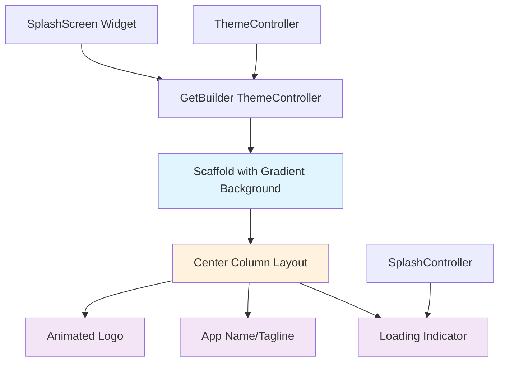
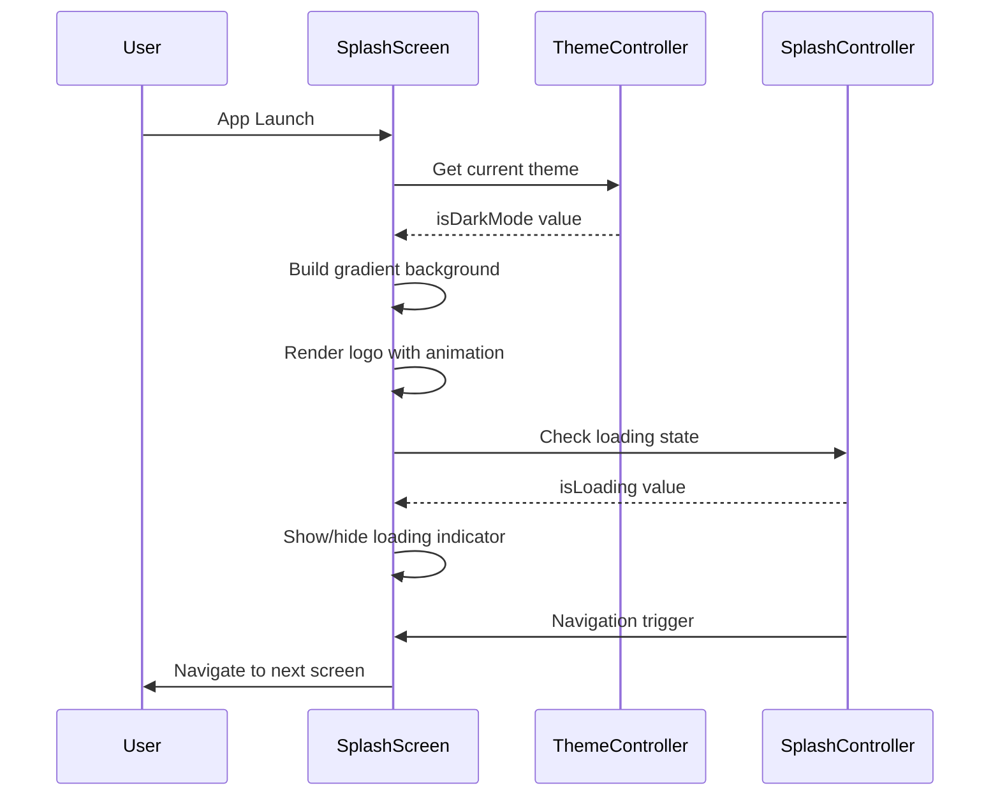

# Design Document: Improved Splash Screen

## Overview

The improved splash screen removes the background image and creates a modern, clean UI with a gradient background that adapts to the app's theme (dark/light mode). The design maintains the centered logo and loading indicator while introducing smooth animations and a more polished visual hierarchy. The new design uses the existing theme colors to create a cohesive brand experience without relying on static background images.

## Architecture

The splash screen follows Flutter's widget composition pattern with GetX state management for theme awareness and loading state.



## Main Algorithm/Workflow



## Components and Interfaces

### Component 1: SplashScreen Widget

**Purpose**: Main splash screen widget that displays the app's initial loading screen with theme-aware gradient background

**Interface**:
```dart
class SplashScreen extends StatelessWidget {
  const SplashScreen({Key? key}) : super(key: key);
  
  @override
  Widget build(BuildContext context);
}
```

**Responsibilities**:
- Render gradient background based on current theme
- Display centered logo with fade-in animation
- Show loading indicator when app is initializing
- Respond to theme changes in real-time

### Component 2: Gradient Background

**Purpose**: Creates a smooth gradient background that adapts to light/dark theme

**Interface**:
```dart
Widget _buildGradientBackground(bool isDarkMode) {
  return Container(
    decoration: BoxDecoration(
      gradient: LinearGradient(
        begin: Alignment.topLeft,
        end: Alignment.bottomRight,
        colors: isDarkMode ? darkGradientColors : lightGradientColors,
      ),
    ),
  );
}
```

**Responsibilities**:
- Provide theme-appropriate gradient colors
- Create smooth color transitions
- Fill entire screen area

### Component 3: Animated Logo Container

**Purpose**: Displays the app logo with smooth fade-in and scale animations

**Interface**:
```dart
Widget _buildAnimatedLogo() {
  return AnimatedOpacity(
    opacity: 1.0,
    duration: Duration(milliseconds: 800),
    child: AnimatedScale(
      scale: 1.0,
      duration: Duration(milliseconds: 600),
      child: Image.asset(ImageConstants.logo, width: 180),
    ),
  );
}
```

**Responsibilities**:
- Animate logo entrance
- Maintain proper logo sizing
- Ensure smooth visual transitions

### Component 4: Loading Indicator

**Purpose**: Shows loading state with theme-aware styling

**Interface**:
```dart
Widget _buildLoadingIndicator(bool isLoading, bool isDarkMode) {
  return Visibility(
    visible: isLoading,
    child: CircularProgressIndicator(
      valueColor: AlwaysStoppedAnimation<Color>(
        isDarkMode ? Colors.white : AppColors.primaryColor,
      ),
    ),
  );
}
```

**Responsibilities**:
- Display loading state
- Match theme colors
- Provide visual feedback during initialization

## Data Models

### GradientColors Model

```dart
class GradientColors {
  final List<Color> lightModeColors;
  final List<Color> darkModeColors;
  
  const GradientColors({
    required this.lightModeColors,
    required this.darkModeColors,
  });
}
```

**Validation Rules**:
- Each color list must contain at least 2 colors
- Colors must be valid Color objects
- Lists cannot be empty

### AnimationConfig Model

```dart
class AnimationConfig {
  final Duration fadeInDuration;
  final Duration scaleDuration;
  final Curve animationCurve;
  
  const AnimationConfig({
    this.fadeInDuration = const Duration(milliseconds: 800),
    this.scaleDuration = const Duration(milliseconds: 600),
    this.animationCurve = Curves.easeInOut,
  });
}
```

**Validation Rules**:
- Durations must be positive
- Animation curve must be non-null
- Durations should be reasonable (< 2000ms for splash screens)

## Algorithmic Pseudocode

### Main Splash Screen Rendering Algorithm

```pascal
ALGORITHM renderSplashScreen(context, themeController, splashController)
INPUT: context (BuildContext), themeController (ThemeController), splashController (SplashController)
OUTPUT: Widget tree representing splash screen

BEGIN
  ASSERT context IS NOT NULL
  ASSERT themeController IS NOT NULL
  ASSERT splashController IS NOT NULL
  
  // Step 1: Determine current theme
  isDarkMode ← themeController.isDarkMode
  
  // Step 2: Select gradient colors based on theme
  IF isDarkMode THEN
    gradientColors ← [darkPrimaryColor, darkBackgroundColor, darkCardColor]
  ELSE
    gradientColors ← [primaryColor, backgroundColor, Colors.white]
  END IF
  
  // Step 3: Build gradient background
  background ← createLinearGradient(
    begin: topLeft,
    end: bottomRight,
    colors: gradientColors
  )
  
  // Step 4: Build animated logo
  logo ← createAnimatedLogo(
    imagePath: ImageConstants.logo,
    width: 180,
    fadeInDuration: 800ms,
    scaleDuration: 600ms
  )
  
  // Step 5: Build loading indicator
  isLoading ← splashController.isLoading.value
  loadingIndicator ← createLoadingIndicator(
    visible: isLoading,
    color: isDarkMode ? white : primaryColor
  )
  
  // Step 6: Compose widget tree
  widget ← Scaffold(
    body: Container(
      decoration: background,
      child: Center(
        child: Column(
          mainAxisAlignment: center,
          children: [
            logo,
            SizedBox(height: 30),
            loadingIndicator
          ]
        )
      )
    )
  )
  
  ASSERT widget IS NOT NULL
  RETURN widget
END
```

**Preconditions:**
- BuildContext must be valid and non-null
- ThemeController must be initialized and available via GetX
- SplashController must be initialized and available via GetX
- Logo asset must exist at ImageConstants.logo path

**Postconditions:**
- Returns a valid Widget tree
- Widget tree contains gradient background
- Widget tree contains centered logo and loading indicator
- All animations are properly configured
- Theme colors are correctly applied

**Loop Invariants:** N/A (no loops in main algorithm)

### Gradient Color Selection Algorithm

```pascal
ALGORITHM selectGradientColors(isDarkMode)
INPUT: isDarkMode (boolean)
OUTPUT: colors (List<Color>)

BEGIN
  ASSERT isDarkMode IS boolean
  
  IF isDarkMode THEN
    // Dark mode gradient: deep colors with subtle variation
    colors ← [
      Color(0xFF1E1E1E),  // Dark card color
      Color(0xFF121212),  // Dark background
      Color(0xFF0A0A0A)   // Deeper black
    ]
  ELSE
    // Light mode gradient: bright colors with primary brand color
    colors ← [
      Color(0xFF1E3A6F),  // Primary color (top)
      Color(0xFFE3F2FD),  // Light blue tint (middle)
      Color(0xFFFFFFFF)   // White (bottom)
    ]
  END IF
  
  ASSERT colors.length = 3
  ASSERT all colors are valid Color objects
  
  RETURN colors
END
```

**Preconditions:**
- isDarkMode is a valid boolean value

**Postconditions:**
- Returns a list of exactly 3 Color objects
- Colors are appropriate for the specified theme mode
- Colors create a smooth gradient transition

**Loop Invariants:** N/A (no loops)

### Animation Initialization Algorithm

```pascal
ALGORITHM initializeAnimations()
INPUT: none
OUTPUT: animationConfig (AnimationConfig)

BEGIN
  // Define animation timings
  fadeInDuration ← 800 milliseconds
  scaleDuration ← 600 milliseconds
  animationCurve ← Curves.easeInOut
  
  // Create configuration
  animationConfig ← AnimationConfig(
    fadeInDuration: fadeInDuration,
    scaleDuration: scaleDuration,
    animationCurve: animationCurve
  )
  
  ASSERT animationConfig.fadeInDuration > 0
  ASSERT animationConfig.scaleDuration > 0
  ASSERT animationConfig.animationCurve IS NOT NULL
  
  RETURN animationConfig
END
```

**Preconditions:**
- None (uses constant values)

**Postconditions:**
- Returns valid AnimationConfig object
- All durations are positive
- Animation curve is properly defined

**Loop Invariants:** N/A (no loops)

## Key Functions with Formal Specifications

### Function 1: _buildGradientBackground()

```dart
Widget _buildGradientBackground(bool isDarkMode)
```

**Preconditions:**
- `isDarkMode` is a valid boolean value

**Postconditions:**
- Returns a Container widget with LinearGradient decoration
- Gradient contains exactly 3 colors
- Colors match the current theme mode
- Gradient direction is from topLeft to bottomRight

**Loop Invariants:** N/A

### Function 2: _buildAnimatedLogo()

```dart
Widget _buildAnimatedLogo()
```

**Preconditions:**
- ImageConstants.logo path is valid and asset exists
- Animation durations are positive values

**Postconditions:**
- Returns an AnimatedOpacity widget wrapping AnimatedScale
- Logo width is set to 180 pixels
- Fade-in duration is 800ms
- Scale duration is 600ms
- Initial opacity is 1.0, initial scale is 1.0

**Loop Invariants:** N/A

### Function 3: _buildLoadingIndicator()

```dart
Widget _buildLoadingIndicator(bool isLoading, bool isDarkMode)
```

**Preconditions:**
- `isLoading` is a valid boolean value
- `isDarkMode` is a valid boolean value
- AppColors.primaryColor is defined

**Postconditions:**
- Returns a Visibility widget containing CircularProgressIndicator
- Indicator is visible only when `isLoading` is true
- Indicator color is white in dark mode, primaryColor in light mode
- Widget is properly centered

**Loop Invariants:** N/A

### Function 4: _getGradientColors()

```dart
List<Color> _getGradientColors(bool isDarkMode)
```

**Preconditions:**
- `isDarkMode` is a valid boolean value
- AppColors constants are properly defined

**Postconditions:**
- Returns a list of exactly 3 Color objects
- If `isDarkMode` is true, returns dark theme colors
- If `isDarkMode` is false, returns light theme colors
- All colors in the list are valid Color objects

**Loop Invariants:** N/A

## Example Usage

```dart
// Example 1: Basic splash screen rendering
class SplashScreen extends StatelessWidget {
  const SplashScreen({Key? key}) : super(key: key);

  @override
  Widget build(BuildContext context) {
    final splashController = Get.find<SplashController>();
    final themeController = Get.find<ThemeController>();

    return GetBuilder<ThemeController>(
      builder: (themeController) {
        return Scaffold(
          body: _buildGradientBackground(themeController.isDarkMode),
        );
      },
    );
  }
  
  Widget _buildGradientBackground(bool isDarkMode) {
    final colors = _getGradientColors(isDarkMode);
    
    return Container(
      decoration: BoxDecoration(
        gradient: LinearGradient(
          begin: Alignment.topLeft,
          end: Alignment.bottomRight,
          colors: colors,
        ),
      ),
      child: Center(
        child: Column(
          mainAxisAlignment: MainAxisAlignment.center,
          children: [
            _buildAnimatedLogo(),
            const SizedBox(height: 30),
            Obx(() => _buildLoadingIndicator(
              splashController.isLoading.value,
              isDarkMode,
            )),
          ],
        ),
      ),
    );
  }
}

// Example 2: Gradient color selection
List<Color> _getGradientColors(bool isDarkMode) {
  if (isDarkMode) {
    return [
      const Color(0xFF1E1E1E),
      const Color(0xFF121212),
      const Color(0xFF0A0A0A),
    ];
  } else {
    return [
      AppColors.primaryColor,
      const Color(0xFFE3F2FD),
      Colors.white,
    ];
  }
}

// Example 3: Animated logo with fade and scale
Widget _buildAnimatedLogo() {
  return TweenAnimationBuilder<double>(
    tween: Tween(begin: 0.0, end: 1.0),
    duration: const Duration(milliseconds: 800),
    curve: Curves.easeInOut,
    builder: (context, value, child) {
      return Opacity(
        opacity: value,
        child: Transform.scale(
          scale: 0.8 + (0.2 * value),
          child: child,
        ),
      );
    },
    child: Image.asset(
      ImageConstants.logo,
      width: 180,
    ),
  );
}
```

## Correctness Properties

### Property 1: Theme Consistency
**Universal Quantification**: ∀ theme ∈ {light, dark}, the gradient colors selected must match the theme mode

```dart
// Property test assertion
assert(
  isDarkMode 
    ? gradientColors.every((c) => c.computeLuminance() < 0.3)
    : gradientColors.any((c) => c.computeLuminance() > 0.5)
);
```

### Property 2: Animation Timing
**Universal Quantification**: ∀ animation ∈ {fadeIn, scale}, animation duration must be > 0 and < 2000ms

```dart
// Property test assertion
assert(fadeInDuration.inMilliseconds > 0 && fadeInDuration.inMilliseconds < 2000);
assert(scaleDuration.inMilliseconds > 0 && scaleDuration.inMilliseconds < 2000);
```

### Property 3: Widget Tree Validity
**Universal Quantification**: ∀ build context, the widget tree must contain exactly one Scaffold, one gradient Container, and one Center widget

```dart
// Property test assertion
assert(widget is Scaffold);
assert((widget as Scaffold).body is Container);
assert(((widget as Scaffold).body as Container).child is Center);
```

### Property 4: Loading Indicator Visibility
**Universal Quantification**: ∀ loading state, the loading indicator visibility must match the isLoading value

```dart
// Property test assertion
assert(loadingIndicator.visible == splashController.isLoading.value);
```

### Property 5: Gradient Color Count
**Universal Quantification**: ∀ theme mode, gradient colors list must contain exactly 3 colors

```dart
// Property test assertion
assert(_getGradientColors(isDarkMode).length == 3);
```

## Error Handling

### Error Scenario 1: Missing Logo Asset

**Condition**: ImageConstants.logo path does not exist or asset is not found
**Response**: Display placeholder or app name text instead of image
**Recovery**: Log error and continue with text-based splash screen

### Error Scenario 2: Theme Controller Not Found

**Condition**: Get.find<ThemeController>() throws exception
**Response**: Use default light theme colors
**Recovery**: Initialize with system theme and log warning

### Error Scenario 3: Invalid Color Values

**Condition**: Color constants are null or invalid
**Response**: Fall back to Material Design default colors
**Recovery**: Use Colors.blue and Colors.white as safe defaults

### Error Scenario 4: Animation Initialization Failure

**Condition**: Animation controllers fail to initialize
**Response**: Display static splash screen without animations
**Recovery**: Show logo and loading indicator without transitions

## Testing Strategy

### Unit Testing Approach

Test individual widget components and helper functions:
- Test `_getGradientColors()` returns correct colors for both themes
- Test `_buildGradientBackground()` creates proper Container with LinearGradient
- Test `_buildAnimatedLogo()` returns widget with correct animation properties
- Test `_buildLoadingIndicator()` visibility matches loading state
- Mock ThemeController and SplashController for isolated testing

**Key Test Cases**:
1. Gradient colors are correct for light mode
2. Gradient colors are correct for dark mode
3. Logo animation properties are set correctly
4. Loading indicator shows when isLoading is true
5. Loading indicator hides when isLoading is false

### Property-Based Testing Approach

Use property-based testing to verify invariants across different states:

**Property Test Library**: flutter_test with custom property generators

**Properties to Test**:
1. **Theme Consistency**: For any theme mode, gradient colors must have appropriate luminance values
2. **Animation Bounds**: For any animation duration, value must be between 0 and 2000ms
3. **Color List Length**: For any theme mode, gradient colors list must have exactly 3 elements
4. **Widget Tree Structure**: For any build context, widget tree must have correct hierarchy
5. **Loading State Sync**: For any loading state value, indicator visibility must match

### Integration Testing Approach

Test the complete splash screen flow:
- Test splash screen renders correctly on app launch
- Test theme switching updates gradient colors in real-time
- Test navigation from splash to next screen
- Test loading indicator appears during initialization
- Test animations complete before navigation

## Performance Considerations

- Use `const` constructors wherever possible to reduce widget rebuilds
- Gradient rendering is GPU-accelerated, no performance concerns
- Animations use Flutter's optimized animation framework
- GetBuilder only rebuilds when theme changes, minimizing unnecessary renders
- Logo asset should be optimized (PNG with appropriate resolution)
- Consider using `RepaintBoundary` around animated logo if performance issues arise

## Security Considerations

- No sensitive data is displayed on splash screen
- No network calls or data storage operations
- Theme preference is stored locally using SharedPreferences (non-sensitive)
- Logo asset is bundled with app, no external loading

## Dependencies

**Existing Dependencies** (already in project):
- `flutter/material.dart` - Core Flutter widgets
- `get` - State management and dependency injection
- `ThemeController` - Theme state management
- `SplashController` - Splash screen logic and navigation
- `ImageConstants` - Asset path constants
- `AppColors` - Color palette constants

**No New Dependencies Required**

## Design Specifications

### Light Mode Gradient
- Top: `#1E3A6F` (Primary Color - Deep Blue)
- Middle: `#E3F2FD` (Light Blue Tint)
- Bottom: `#FFFFFF` (White)

### Dark Mode Gradient
- Top: `#1E1E1E` (Dark Card Color)
- Middle: `#121212` (Dark Background)
- Bottom: `#0A0A0A` (Deeper Black)

### Logo Specifications
- Width: 180px
- Fade-in duration: 800ms
- Scale animation: 0.8 to 1.0 over 600ms
- Animation curve: easeInOut

### Loading Indicator
- Type: CircularProgressIndicator
- Light mode color: Primary Color (#1E3A6F)
- Dark mode color: White (#FFFFFF)
- Position: 30px below logo

### Spacing
- Logo to loading indicator: 30px vertical spacing
- All content centered horizontally and vertically
